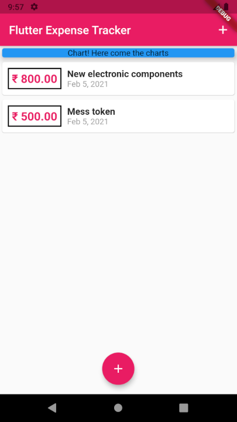

# Expense_tracker

A new Flutter project.

### Widgets
- `Column` - It used to show items vertically.
    -   `mainAxisAlignment` - top to down in column
    - `crossAxisAlignment` - from left to right in column
    
- `Row` - It is used to order items horizontally.
- `Card` - This widget is used show some content.
    - It takes the width of the widget with largest width.
    - It takes the size of the child widget unless there is a parent with well defined size.

### intl
- `intl` - package used for date formatting(as of now i know).

### TextEditingController
- `Controller` can be used to get input from user without changing the widget to stateful widget.

### Output

